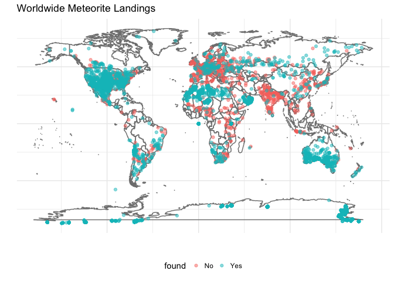

Meteorite Landings
==================

*2017-03-11*

Summary
-------

This comprehensive data set from The Meteorological Society contains
information on all of the known meteorite landings.

Analysis
--------

The goal of this analysis is to create an insightful and interactive
data visualization which draws some inference about meteorite landing
locations, mass, and year of occurrence.

```r
    library(ggplot2)
    library(RSocrata)
    library(devtools)
    library(gganimate)
    library(magick)
    library(dplyr)
    library(ggmap)
    library(gapminder)
    library(animation)
    library(lubridate)
```

```r
    data_in <- read.socrata("https://data.nasa.gov/Space-Science/Meteorite-Landings/gh4g-9sfh")
```

```r
    head(data_in)
```

    ##       name  id nametype    recclass mass..g. fall       year    reclat
    ## 1   Aachen   1    Valid          L5       21 Fell 1880-01-01  50.77500
    ## 2   Aarhus   2    Valid          H6      720 Fell 1951-01-01  56.18333
    ## 3     Abee   6    Valid         EH4   107000 Fell 1952-01-01  54.21667
    ## 4 Acapulco  10    Valid Acapulcoite     1914 Fell 1976-01-01  16.88333
    ## 5  Achiras 370    Valid          L6      780 Fell 1902-01-01 -33.16667
    ## 6 Adhi Kot 379    Valid         EH4     4239 Fell 1919-01-01  32.10000
    ##      reclong          GeoLocation
    ## 1    6.08333    (50.775, 6.08333)
    ## 2   10.23333 (56.18333, 10.23333)
    ## 3 -113.00000   (54.21667, -113.0)
    ## 4  -99.90000    (16.88333, -99.9)
    ## 5  -64.95000  (-33.16667, -64.95)
    ## 6   71.80000         (32.1, 71.8)

### Clean up column names

```r
    names(data_in)[c(3, 4, 5, 6, 8, 9)] <- c("name_type", "class", "mass", "found", "latitude", "longitude")
    names(data_in)
```

    ##  [1] "name"        "id"          "name_type"   "class"       "mass"       
    ##  [6] "found"       "year"        "latitude"    "longitude"   "GeoLocation"

### Fix the year by removing MM-DD

```r
    data_in$year_fix <- year(data_in$year)
```

### Explore the variables by class distribution

```r
    data_in %>% group_by(class) %>% 
                summarise(n = n()) %>% 
                arrange(desc(n))
```

    ## # A tibble: 466 × 2
    ##    class     n
    ##    <chr> <int>
    ## 1     L6  8285
    ## 2     H5  7142
    ## 3     L5  4796
    ## 4     H6  4528
    ## 5     H4  4211
    ## 6    LL5  2766
    ## 7    LL6  2043
    ## 8     L4  1253
    ## 9   H4/5   428
    ## 10   CM2   416
    ## # ... with 456 more rows

```r
    data_in %>% group_by(name_type) %>% 
                summarise(n = n()) %>% 
                arrange(desc(n))
```

    ## # A tibble: 2 × 2
    ##   name_type     n
    ##       <chr> <int>
    ## 1     Valid 45641
    ## 2    Relict    75

### Filter out erroneous latitudes and longitudes

```r
    data_in_clean <- data_in %>% filter(latitude >= -90 & 
                                        latitude  <= 90 & 
                                        longitude >= -180 &
                                        longitude <= 180  & 
                                        !is.na(mass), 
                                        !is.na(year))
```

### Clean up method of whether the meteorite was Found or not

```r
    data_in_clean$found <- if_else(data_in_clean$found == "Fell", "No", "Yes")
```    


Visualizations
--------------

### Set up some options for plotting

```r
    theme_set(theme_minimal())

    options(scipen=10000)
```

### Static display

```r
    p <- ggplot() +
        borders("world", colour="gray50") +
        geom_point(aes(x = longitude, y = latitude, color = found, frame = year_fix), data = data_in_clean, alpha = .5) +
        labs(title = "Worldwide Meteorite Landings ", 
           x = "", y = "") +
        theme(legend.position="bottom", 
            axis.text.x = element_blank(),
            axis.text.y = element_blank(),
            axis.ticks = element_blank())

    p
```



```r
    gganimate(p, "meteorite-landings.gif")
```


Insights
--------

-   Dominant areas where meteorites were found are: Australia, USA, and
    Antarctica

Resources
---------

*I reused some code and modified examples from:*

1.  <https://rpubs.com/MVellinger/Gibeon>

2.  <http://relevantmisc.com/ggplot/instagram/2016/02/14/ig-over-time/>

3.  <https://rpubs.com/sjackman/gapminder-gganimate>

*Thanks to [Bob
Rudis](https://twitter.com/hrbrmstr/status/840622466707922944) for
helping me to get ImageMagick installed (Twitter is a powerful
resource)*
